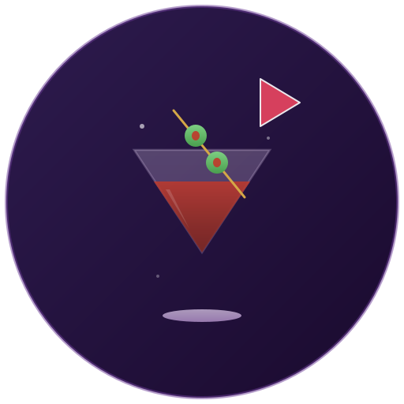
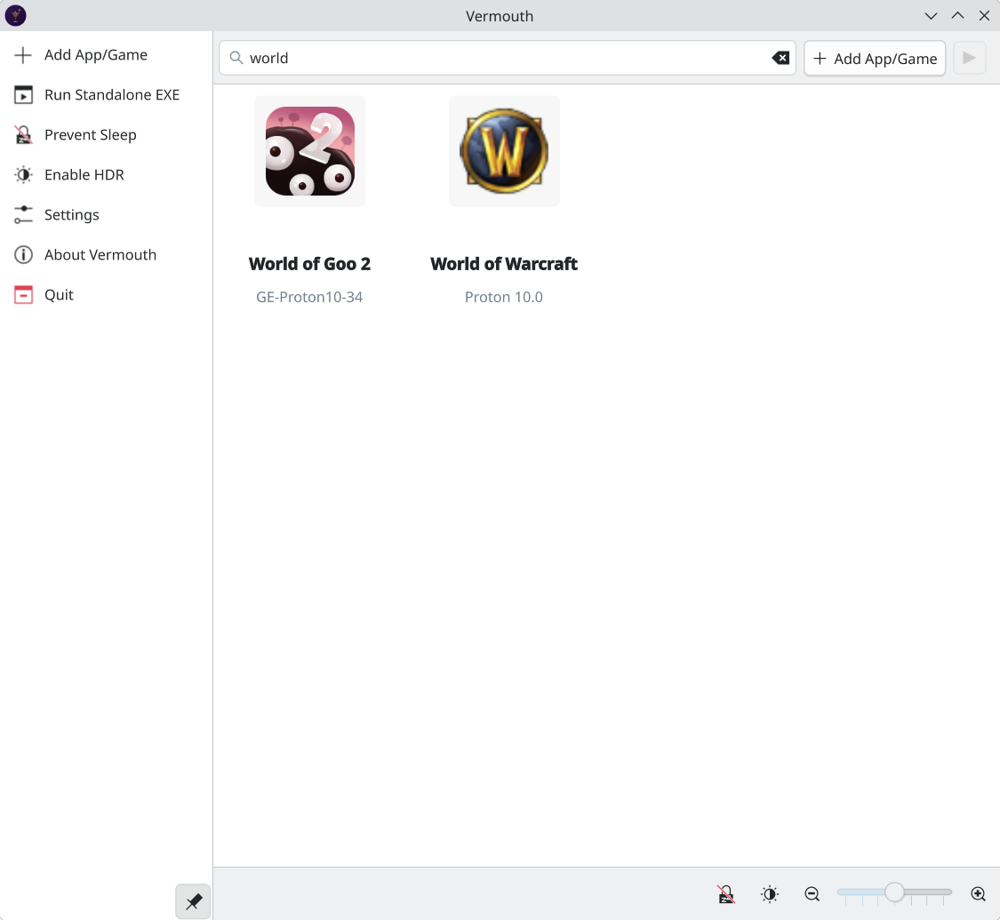
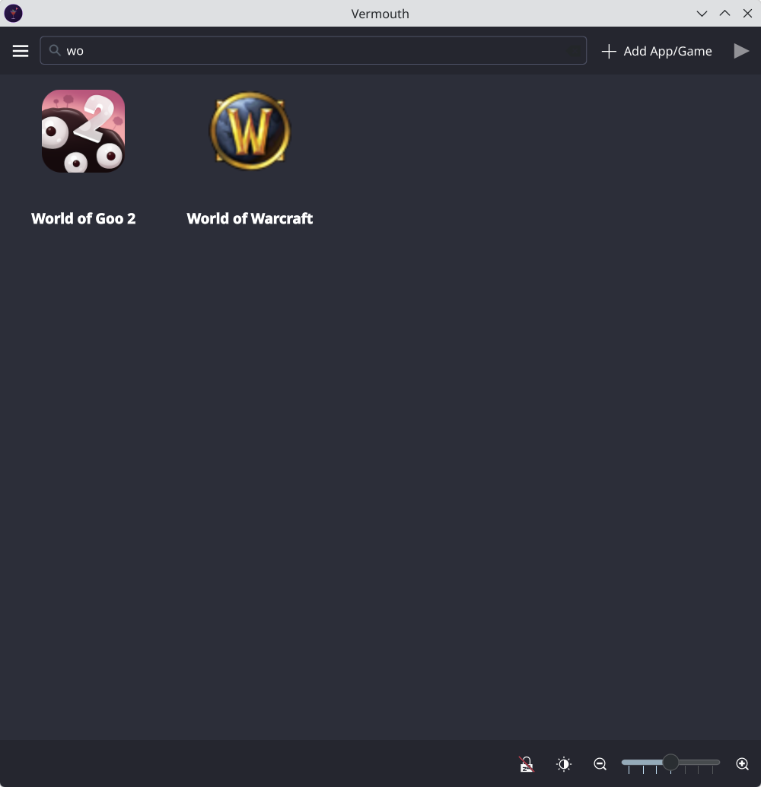
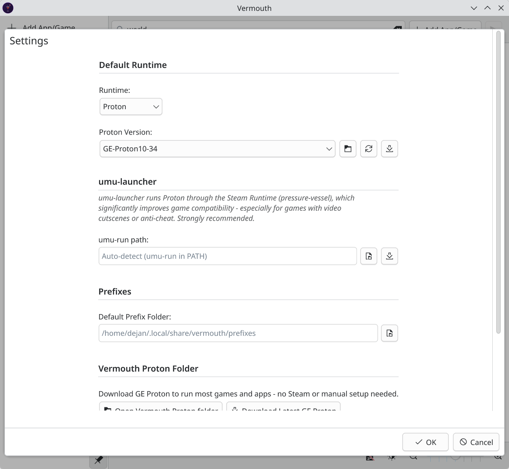

[](https://github.com/dekomote/vermouth/actions/workflows/build-appimage.yml)
[](https://github.com/dekomote/vermouth/actions/workflows/build-deb.yml)
[](https://github.com/dekomote/vermouth/actions/workflows/build-rpm.yml)
[](https://github.com/dekomote/vermouth/actions/workflows/build-flatpak.yml)
[](https://github.com/dekomote/vermouth/actions/workflows/build-arch.yml)
[](https://github.com/dekomote/vermouth/actions/workflows/build-arch.yml)


<p align="center">
  
</p>

<h1 align="center">Vermouth</h1>

<p align="center">A no-frills game (or any Windows exe) launcher for KDE.<br>
Point it at Windows executables and run them with Proton or Wine.</p>

<p align="center">
  
  
  
</p>

## What it does

Vermouth keeps a list of your games and applications, paired with a Proton or Wine version. Double-click to launch. That's pretty much it.
It works like Lutris, Heroic, Fagus or Bottles, but:

- It's KDE first (written in Qt/Qml and using Kirigami)
- It tries to be lighter and easier to use - less buttons, checks and knobs, just the bare necessities.

Additionally:

- It searches for Proton versions from your Steam installation automatically, including custom ones like GE-Proton
- You can also download the latest GE Proton release and set everything up with one click, if you don't have Steam
- You can place custom proton builds in its local folder (usually ~/.local/share/vermouth/protons, there's a button to open it)
- Wine works too - just point it at the Wine binary and set a prefix folder
- It will try to extract icons from .exe files so the grid actually looks nice, you just install `icoutils`
- You can define launch options with `%command%` placeholder, same as in Steam (e.g. `mangohud %command%`)
- You can run a separate .exe inside an existing prefix (useful for installers, config tools, etc.)
- You can create start menu entries and desktop shortcuts for individual games, and they work without opening the application window

## Installing

In the [releases section](https://github.com/dekomote/vermouth/releases/latest), you can find pre-built packages:

- The deb package can be used for Ubuntu 25.04 and onward
- The rpm package can be used for Fedora 41+ and OpenSuse
- The flatpack package and the AppImage are universal for x86_64
- You can also find a package for Archlinux as well as PKGBUILD pack

I have limited testing capabilities at the moment, so please, report any bugs you might find.

For icon extraction from .exe files, install `icoutils` (provides `wrestool` and `icotool`).

## Building from source

You need Qt 6 and CMake. On Fedora:

```
sudo dnf install cmake gcc-c++ extra-cmake-modules qt6-qtbase-devel qt6-qtdeclarative-devel qt6-qtquickcontrols2-devel kf6-kirigami-devel kf6-kcoreaddons-devel kf6-ki18n-devel kf6-qqc2-desktop-style
```

On *buntu:

```
sudo apt install build-essential cmake extra-cmake-modules qt6-base-dev qt6-declarative-dev qt6-tools-dev-tools libkirigami-dev libkf6coreaddons-dev libkf6i18n-dev libkf6qqc2desktopstyle-dev
```

On Arch and derrivatives:

```
pacman -S --needed base-devel cmake ninja extra-cmake-modules qt6-base qt6-declarative kirigami ki18n kcoreaddons qqc2-desktop-style
```

Then inside the root folder of the project:

```
cmake -B build
cmake --build build
./build/bin/vermouth
```

For icon extraction from .exe files, install `icoutils` (provides `wrestool` and `icotool`).

## How to use it

Open the app, click the "Add App/Game" button on the top right, browse for the exe file, choose the Proton version in the dropdown (click Download GE Proton if you don't have any versions in the list) and then launch the game from the grid!

The optional fields can be ommited. The name, and icon will be inferred from the exe (you need icoutils for the icon), the prefix will be set based on the game name and the default prefix folder.

The launch options field lets you wrap the command with tools like mangohud, gamescope, or gamemoderun. Use `%command%` as the placeholder for where the actual game command goes. If you leave out `%command%`, your options get prepended automatically.

In the app's settings you can set the default prefix folder to your liking and add additional folders to be scanned for Proton versions.

## How it works

Games are stored in `~/.config/vermouth/apps.json`. Proton is launched the same way Steam does it, by calling the `proton run` script with `STEAM_COMPAT_DATA_PATH` set to your prefix. Wine games just get `WINEPREFIX` set and the binary called directly.


## AI Disclaimer

The code has been developed, reviewed and tested by a human. However, development included assistance of AI tools, so keep that in mind.
